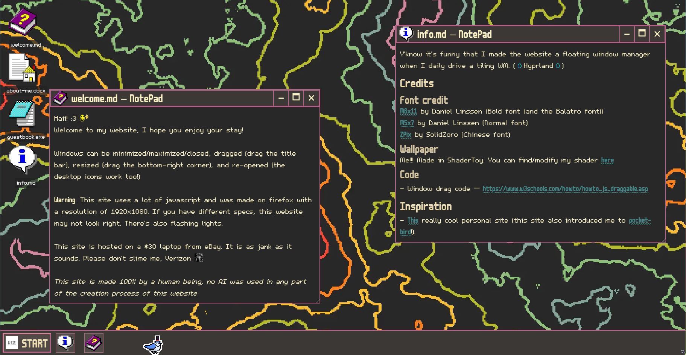

# Mildlyintelligent.gay
A personal website for me to share about myself with the world.

Bird not included

[Try it!](mildlyintelligent.gay)

## Features

- Windows that can be dragged around and resized
- Working Close, Minimize, and Maximize buttons
- A working taskbar
- A guestbook powered by Atabook

## Credits

All necessary crediting is in the `info.md` window on the website but for redundancy:

### Fonts

- [M5x7](https://managore.itch.io/m5x7) By Daniel Linssen (Normal font)
- [M6x11](https://managore.itch.io/m6x11) By Daniel Linssen (Bold font)
- [ZPix](https://github.com/SolidZORO/zpix-pixel-font) By SolidZoro and contributors (Chinese font)

### Code

- [Window drag code](https://www.w3schools.com/howto/howto_js_draggable.asp) By W3Schools

### Color Palette

- [Gruvbox](https://github.com/morhetz/gruvbox) by Pavel Pertzev (aka morhetz on GitHub) and contributors

## AI Use

"You're getting nada"

I did not use AI whatsoever in this project